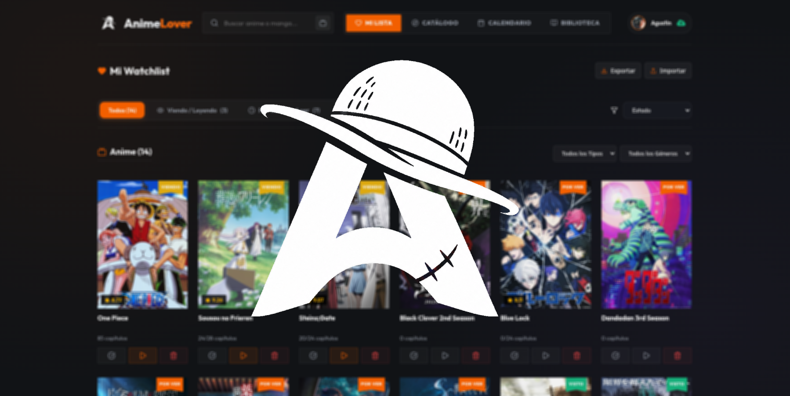
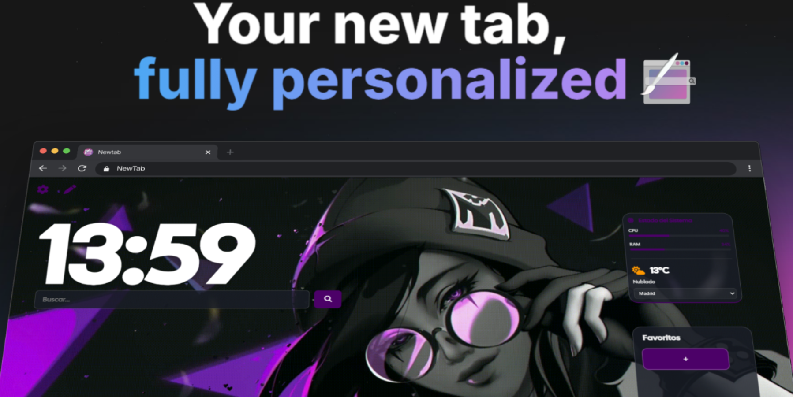
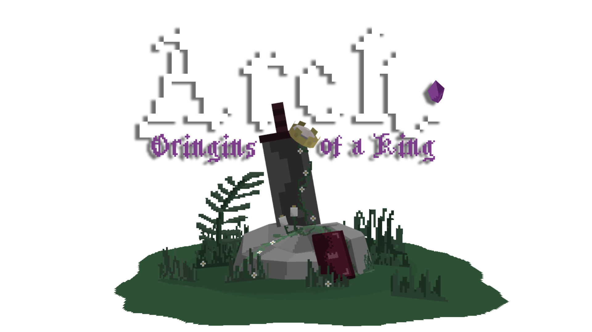

# 👑 Agustín Benítez | AgusTheKing dev </>

  
  

---

### 👑 About Me

  Passionate Computer Science student specializing in Microcomputer Systems and Networks. 
  Currently mastering web technologies and always eager to learn new skills and take on exciting challenges.

 

---

## ⚙️ Tech Stack

  

---

## 🎯 Featured Projects

  <table>
    <tr>
      <td width="50%">
        <h3 align="center" style="color: #44AEFB;">🔥 AnimeLover</h3>
        

          
            
          
<b>Anime & Manga Tracker</b> - Web application to manage your personal watchlists

          
           
        

      </td>
      <td width="50%">
        <h3 align="center" style="color: #44AEFB;">🌐 Browser Extension</h3>
        

          
            
          
<b>Browser Extension</b> - Custom start page with useful features

          
           
        

      </td>
    </tr>
    <tr>
      <td width="50%">
        <h3 align="center" style="color: #44AEFB;">🛍️ Tienda EnmaManualidades</h3>
        

          
            
          
<b>E-commerce platform</b> - Modern online store with responsive design

          
           
        

      </td>
      <td width="50%">
        <h3 align="center" style="color: #44AEFB;">🎮 Valorantdle</h3>
        

          
            
          
<b>Gaming Quiz</b> - Interactive Valorant-themed guessing game

          
           
        

      </td>
    </tr>
    <tr>
    <td width="50%">
        <h3 align="center" style="color: #44AEFB;">💼 Portfolio Laura Castro</h3>
        

          
            
          
<b>Professional Portfolio</b> - Clean and elegant design showcase

          
          
        

      </td>
    <td width="50%">
        <h3 align="center" style="color: #44AEFB;"> ARCH: Origins of a King | VideoGame</h3>
        

          
            
          
<b>Arch Roguelite Survivor</b> - Indie , Java

          
           
        

      </td>
    </tr>
  </table>

---

## 🎮 Game Mods

  <table>
    <tr>
      <td width="100%">
        <h3 align="center" style="color: #44AEFB;">⚙️ Indexer Mod</h3>
        

          
            
          
<b>Minecraft Storage Automation</b> - Advanced item sorting and organization system for Minecraft 1.20.1

          
Automate your storage with intelligent filtering, massive range (250+ blocks), and furnace compatibility. Features speed upgrades, multilingual support, and unlimited connector capacity.

          
          
          
        

      </td>
    </tr>
  </table>

---

## 📊 GitHub Stats

  
  

  

### 📈 Contribution Activity

  

  

---

## 🤝 Let's Connect!

  
  
  

  

---

  

